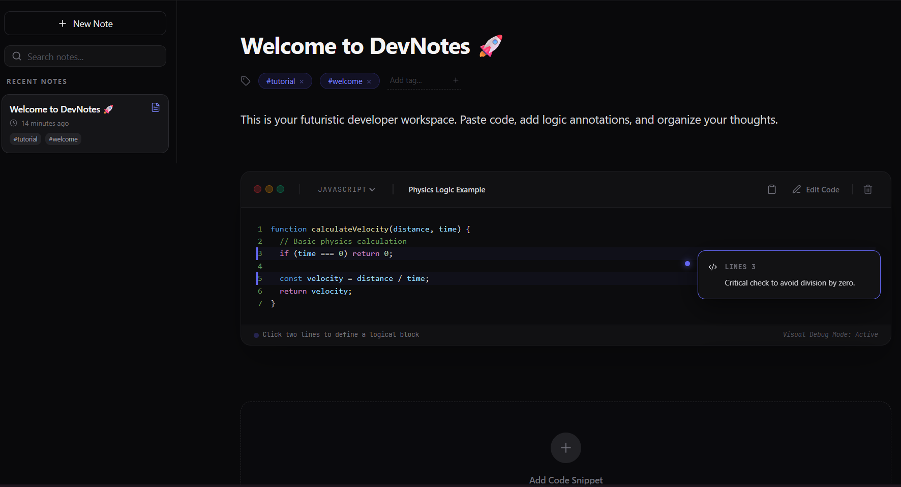

# ⚡ DevNotes — The Indigo & Zinc Developer Workspace

DevNotes is a high-performance, aesthetically-driven developer note-taking platform. Built with a sleek **Zinc & Indigo** theme, it provides a premium experience for managing code logic, logic-flow annotations, and technical insights.



## ✨ Unique Features

-   **🎨 Zinc & Indigo UI Overhaul**: A professional-grade dark mode interface with vibrant indigo accents, custom high-contrast selection effects, and smooth glassmorphism transitions.
-   **🧩 Block-Level Annotations**: Select a block of code (Start -> End) to attach floating, animated logic notes. Perfect for documenting complex algorithms.
-   **🔐 Enterprise-Grade Auth**: Fully integrated with **Clerk** for secure, multi-device access and user profiles.
-   **💾 Hybrid Storage**: Persistent local autosave for offline productivity, backed by a **MongoDB Atlas** cloud synchronization layer.
-   **⚡ Live Preview & Syntax Highlighting**: Real-time rendering of code snippets with support for JavaScript, TypeScript, Python, Rust, and more.

## 🛠️ Technology Stack

-   **Frontend**: React 18 + Vite (Pure speed)
-   **Styling**: Tailwind CSS (Zinc-900 palette)
-   **Animations**: Framer Motion (Micro-interactions)
-   **Auth**: Clerk (Identity Management)
-   **Database**: MongoDB Atlas (Cloud Sync)
-   **Icons**: Lucide React (Minimal & Crisp)

## 🚀 Quick Start

### Prerequisites
-   Node.js (LTS)
-   A Clerk.com account
-   A MongoDB Atlas cluster

### Installation
1.  **Clone the repository:**
    ```bash
    git clone https://github.com/YOUR_USERNAME/devnotes.git
    cd devnotes
    ```
2.  **Install dependencies:**
    ```bash
    npm install
    ```
3.  **Configure Environment:**
    Create a `.env.local` file and add your keys:
    ```env
    VITE_CLERK_PUBLISHABLE_KEY=pk_test_...
    CLERK_SECRET_KEY=sk_test_...
    MONGODB_URI=mongodb+srv://...
    MONGODB_DB=devnotes
    ```
4.  **Launch Dev Space:**
    ```bash
    npm run dev
    ```

## 📐 Logic Visualization

The **Selection Picker** allows you to tag specific lines of code with different semantic types:
-   `Logic`: For explaining how a function works.
-   `Important`: For critical edge-case handling.
-   `Warning`: For potential bugs or optimizations needed.
-   `Tip`: For developer best practices.

## 📄 License
This project is open-source under the MIT License. Developed with pride for the modern coding era.

---

*“Coding is an art. Your notes should be too.”* 🌌